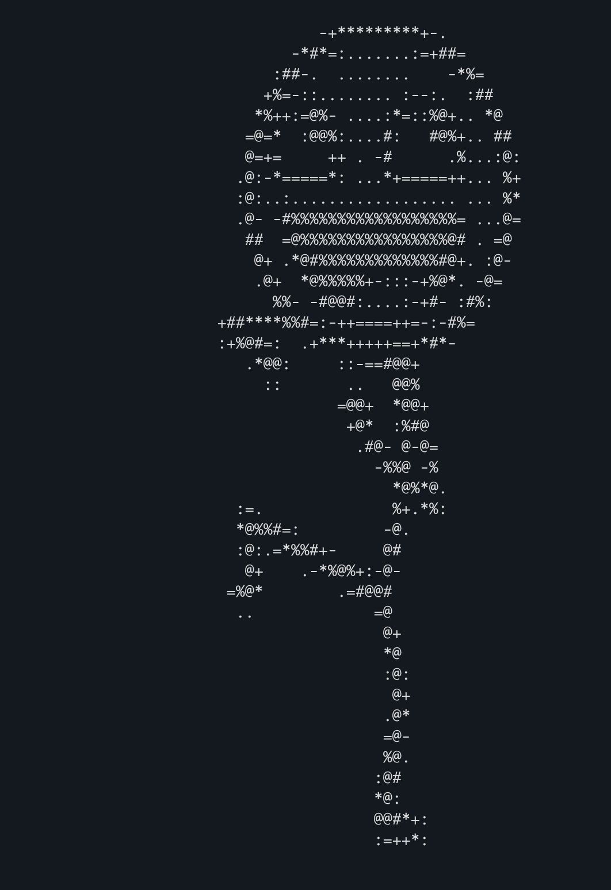

# gen-ascii-art: Image to ASCII Art (Rust)

A command-line tool written in Rust to convert images and GIFs into ASCII art, with options for color, contrast, inversion, and animation looping.

## Features

- Supports common image formats (PNG, JPEG, GIF, etc.).
- Converts static images and animated GIFs.
- Adjustable output width.
- Optional ANSI color output (requires a terminal supporting true color).
- Contrast adjustment.
- Invert mapping (useful for dark backgrounds).
- Option to loop GIF animations.
- Choice between simple high-contrast characters (default) or a more detailed set (used with `--color`).
- Subtle blur applied in color mode to smooth details.

## Output Examples

Below are examples generated from input files like `example.png` and `example.gif` found in the repository.

**Grayscale Output (from `example.png`)**

Command: `gen-ascii-art -i example.png -w 80`



**Color Output (from `example.gif`, requires terminal support)**

Command: `gen-ascii-art -i example.gif -w 80 --color`


_Add a screenshot showing the colorful ANSI output for the GIF here._

## Prerequisites

- Rust programming language and Cargo: [https://www.rust-lang.org/tools/install](https://www.rust-lang.org/tools/install)
- A terminal that supports ANSI true color (for `--color` mode). Most modern terminals (Windows Terminal, iTerm2, GNOME Terminal, Kitty, etc.) do.

## Installation (from Crates.io)

Once the crate is published on crates.io, you can install it directly using Cargo:

```bash
cargo install gen-ascii-art
```

This command will download the source code, compile it, and install the binary (`gen-ascii-art`) into your Cargo binary path (`~/.cargo/bin/` by default), making it available to run directly from your terminal.

## Building

Clone the repository and build the release executable:

```bash
git clone <your-repo-url> # Replace with actual URL later
cd gen-ascii-art # Assumes directory name matches crate name
cargo build --release
```

The executable will be located at `./target/release/gen-ascii-art`.

## Usage

After installing with `cargo install gen-ascii-art`, you can run the command directly:

```bash
gen-ascii-art -i <input_path> [OPTIONS]
```

If you built from source, you would run it like this:

```bash
./target/release/gen-ascii-art -i <input_path> [OPTIONS]
```

**Arguments:**

- `-i`, `--input <PATH>`: Path to the input image or GIF file.

**Options:**

- `-w`, `--width <WIDTH>`: Width of the output ASCII art in characters [default: 100].
- `--invert`: Invert the character map (useful for images with dark backgrounds).
- `--contrast <FACTOR>`: Adjust contrast (1.0 = normal, >1.0 = higher) [default: 1.0].
- `--color`: Output ASCII art with ANSI colors (uses a more detailed character set and applies a subtle blur).
- `--loop-gif`: Loop GIF animation indefinitely (only applies if input is a GIF).
- `-h`, `--help`: Print help information.
- `-V`, `--version`: Print version information.

**Examples:**

```bash
# Simple grayscale conversion (after installation)
gen-ascii-art -i image.png -w 120

# Color conversion with higher contrast
gen-ascii-art -i photo.jpg -w 150 --color --contrast 1.5

# Process a GIF, looping, with inverted mapping for dark background
gen-ascii-art -i animation.gif -w 80 --invert --loop-gif

# Process a GIF with color
gen-ascii-art -i animation.gif -w 90 --color --loop-gif

# If running from build directory (after building from source)
# ./target/release/gen-ascii-art -i image.png -w 120
```
